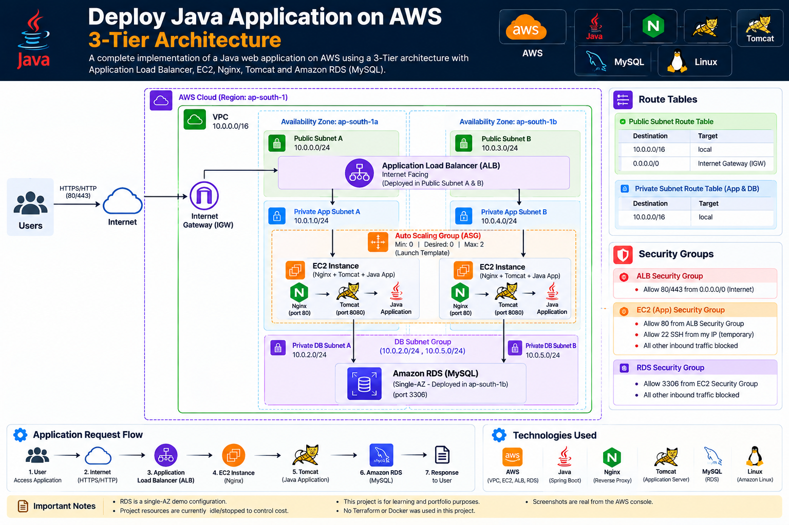

# 🚀 Deploy Java Application on AWS — 3-Tier Architecture

<p align="center">
  
</p>

<p align="center">
  <b>A hands-on AWS Cloud & DevOps project demonstrating a secure 3-tier architecture for a Java web application.</b>
</p>

---

## 📌 Project Overview

This project demonstrates the deployment of a Java web application on AWS using a **3-tier architecture**.

The application is deployed on EC2 instances in private application subnets, placed behind an **Application Load Balancer (ALB)**, with **Nginx** acting as a reverse proxy and **Tomcat** serving the Java application.

The application connects to **Amazon RDS for MySQL** through private networking.

The infrastructure was designed with separate public, application, and database subnets across two Availability Zones.

---

## 🏗️ Architecture

### AWS Network

```text
VPC: 10.0.0.0/16

┌─────────────────────────────────────────────────────────────┐
│                         AWS VPC                             │
│                      10.0.0.0/16                            │
│                                                             │
│  Availability Zone A              Availability Zone B       │
│                                                             │
│  Public Subnet A                  Public Subnet B           │
│  10.0.0.0/24                      10.0.3.0/24               │
│       │                                │                    │
│       └──────────── Internet ──────────┘                    │
│                        │                                    │
│                 Application Load                           │
│                    Balancer                                │
│                        │                                    │
│        ┌───────────────┴───────────────┐                    │
│        │                               │                    │
│  App Subnet A                     App Subnet B              │
│  10.0.1.0/24                      10.0.4.0/24               │
│        │                               │                    │
│     EC2-A                           EC2-B                   │
│   Nginx :80                       Nginx :80                 │
│   Tomcat :8080                    Tomcat :8080              │
│   Java Application                Java Application          │
│        │                               │                    │
│        └───────────────┬───────────────┘                    │
│                        │                                    │
│                 Amazon RDS MySQL                            │
│                        │                                    │
│             DB Subnets A & B                                │
│             10.0.2.0/24                                    │
│             10.0.5.0/24                                    │
└─────────────────────────────────────────────────────────────┘
Note: The RDS instance used in the project was deployed as a single-AZ database for the hands-on implementation. The DB subnet group spans both database subnets.

🔄 Application Request Flow

User
  │
  ▼
Application Load Balancer
  │
  ▼
EC2 Instance
  │
  ▼
Nginx :80
  │
  ▼
Tomcat :8080
  │
  ▼
Java Application
  │
  ▼
Amazon RDS MySQL :3306
  │
  ▼
Java Application
  │
  ▼
Response → User

☁️ AWS Services Used

| AWS Service               | Purpose                                    |
| ------------------------- | ------------------------------------------ |
| Amazon VPC                | Isolated network environment               |
| Internet Gateway          | Internet connectivity for public subnets   |
| EC2                       | Application servers                        |
| Application Load Balancer | Distributes application traffic            |
| Auto Scaling Group        | Maintains application instance capacity    |
| Launch Template           | Defines EC2 instance configuration         |
| Amazon RDS                | Managed MySQL database                     |
| Security Groups           | Network-level access control               |
| Route Tables              | Control subnet traffic routing             |
| IAM                       | EC2 permissions and Systems Manager access |
| AWS Systems Manager       | Instance administration                    |

🌐 VPC & Subnet Design

CIDR: 10.0.0.0/16
Availability Zone A
Subnet	CIDR	Purpose
Public Subnet A	10.0.0.0/24	Public AWS resources
App Subnet A	10.0.1.0/24	Application EC2
DB Subnet A	10.0.2.0/24	Database subnet
Availability Zone B
Subnet	CIDR	Purpose
Public Subnet B	10.0.3.0/24	Public AWS resources
App Subnet B	10.0.4.0/24	Application EC2
DB Subnet B	10.0.5.0/24	Database subnet
🔐 Security Groups
ALB Security Group
Inbound:
HTTP  80   → 0.0.0.0/0
HTTPS 443  → 0.0.0.0/0

Outbound:
All traffic
Application Security Group
Inbound:
HTTP 80 → ALB Security Group
SSH 22  → My administration IP (/32)

No direct internet access to port 8080.
Database Security Group
Inbound:
MySQL 3306 → Application Security Group

No public database access.

This creates a controlled traffic path:

Internet
   ↓
ALB
   ↓
EC2
   ↓
RDS
⚖️ Application Load Balancer

The Application Load Balancer is deployed across the two public subnets.

Internet
   │
   ▼
┌─────────────────────┐
│ Application Load    │
│ Balancer            │
└─────────┬───────────┘
          │
     ┌────┴────┐
     ▼         ▼
   EC2-A     EC2-B

The ALB forwards HTTP traffic to the application target group on port 80.

The target group uses the application health endpoint:

/dptweb-1.0/login

A target is considered healthy when the expected HTTP response is received.

🔄 Auto Scaling

An Auto Scaling Group was configured for the application layer.

Minimum: 0
Desired: 0
Maximum: 2

The group uses a Launch Template containing the application server configuration.

During testing, an application instance was terminated to verify that the Auto Scaling Group could launch a replacement instance.

This demonstrated basic instance recovery and capacity management.

Current project resources are intentionally scaled down/stopped to control AWS costs.

🖥️ Application Server Stack

Each application EC2 instance contains:

Amazon Linux
      │
      ▼
   Nginx
   :80
      │
      ▼
   Tomcat
   :8080
      │
      ▼
Java Web Application
Nginx

Nginx acts as the reverse proxy and receives traffic from the ALB.

Tomcat

Tomcat runs the Java web application.

Java Application

The Java application communicates with the MySQL database hosted on Amazon RDS.

🗄️ Amazon RDS MySQL

The application uses Amazon RDS for MySQL as the database layer.

Database communication:

EC2 Application Server
        │
        │ TCP 3306
        ▼
Amazon RDS MySQL

The RDS instance is placed in the private database subnet and is not directly accessible from the public internet.

Database connectivity was verified from the application layer.

🧪 Failure Testing

A failure scenario was tested by terminating an application EC2 instance managed by the Auto Scaling Group.

Expected behavior:

Application EC2 terminated
          ↓
ASG detects reduced capacity
          ↓
New EC2 instance launched
          ↓
Application configured
          ↓
Target becomes healthy
          ↓
ALB sends traffic to healthy target

This helped validate the relationship between:

Auto Scaling Group
        +
Launch Template
        +
Target Group
        +
Application Load Balancer
🔧 Troubleshooting Experience

During the implementation, several real configuration issues were investigated and resolved, including:

Java/Maven version mismatch
Missing MySQL JDBC driver
Tomcat dependency conflict
Tomcat service configuration
EC2 SSH connectivity
Security Group configuration
AWS Systems Manager access
RDS connectivity
RDS temporary capacity issue
Application Load Balancer target health
Auto Scaling replacement behavior
Private subnet administration

These troubleshooting activities were an important part of the hands-on learning process.

🛠️ Technologies Used
Cloud
AWS
Amazon EC2
Amazon VPC
Application Load Balancer
Auto Scaling
Amazon RDS
IAM
Systems Manager
Application
Java
Apache Tomcat
Nginx
MySQL
Operating System
Amazon Linux 2023
Networking
VPC
CIDR
Public Subnets
Private Subnets
Route Tables
Internet Gateway
Security Groups
📚 Key Learning Outcomes

Through this project, I gained practical experience with:

Designing a 3-tier AWS architecture
Creating and organizing VPC subnets
Understanding public vs private subnets
Configuring route tables
Working with Security Groups
Deploying applications on EC2
Configuring Nginx as a reverse proxy
Running Java applications with Tomcat
Connecting EC2 applications to RDS
Configuring Application Load Balancers
Working with Target Groups and health checks
Using Launch Templates
Configuring Auto Scaling Groups
Testing instance failure and replacement
Troubleshooting AWS networking and application issues
Using AWS Systems Manager for instance administration
💰 Cost Management

This project was created as a hands-on learning and portfolio project.

To control AWS costs after completing the implementation:

Application instances were scaled down.
RDS was stopped.
The project infrastructure was retained for future demonstrations.
Resources are monitored through AWS Billing and Cost Explorer.

Always verify the current AWS pricing and Free Tier eligibility before creating resources.

📌 Project Status

Completed — Hands-on implementation

The architecture was deployed and tested on AWS.

The project is currently kept in an idle/cost-controlled state so that the architecture and configuration can be referenced for future demonstrations and interviews.

👨‍💻 Author

Mohamed Sarbudeen

Cloud & DevOps Engineer

Focused on:

AWS • Linux • Kubernetes • Docker • Terraform • CI/CD • Monitoring

⭐ If you find this project useful, feel free to explore the repository.


### Step 2 — Commit it

At the bottom of GitHub:

**Commit changes**

Commit message:

```text
Add professional project documentation
