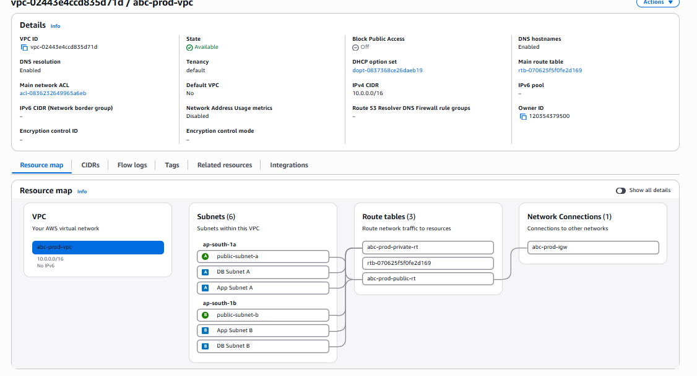
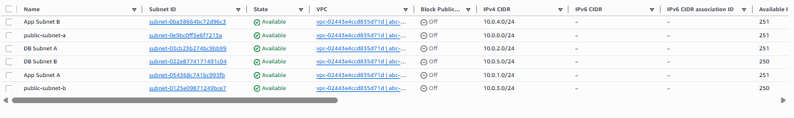
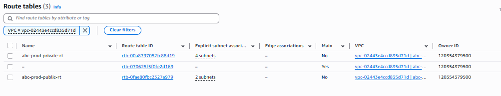
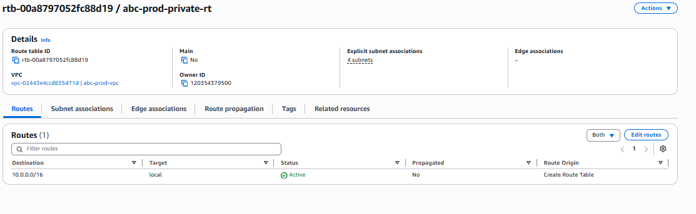
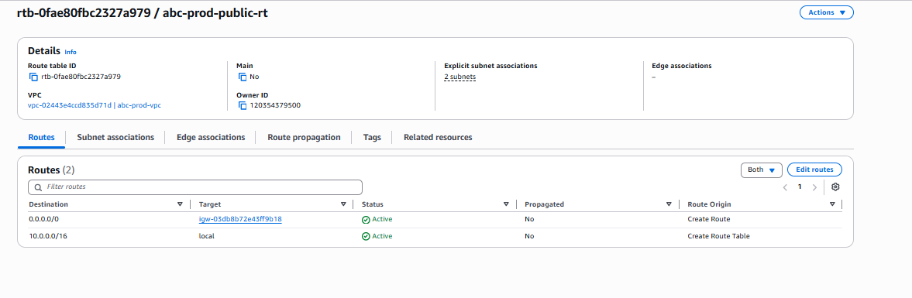
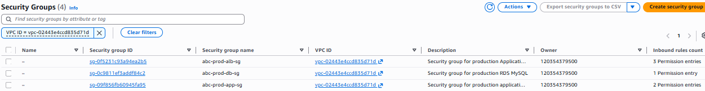
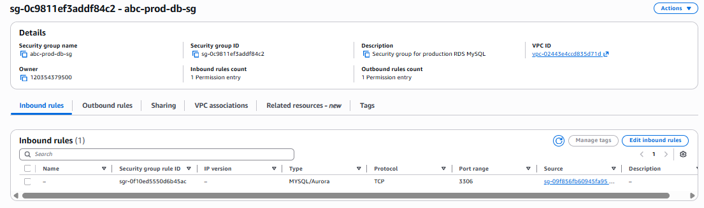

# AWS VPC Infrastructure

This section documents the AWS networking infrastructure completed for Project 1 – Deploy Java Application on AWS 3-Tier Architecture.

## Infrastructure Completed

- AWS VPC: `10.0.0.0/16`
- 2 Availability Zones
- 6 Subnets
  - 2 Public Subnets
  - 2 Private Application Subnets
  - 2 Private Database Subnets
- Public Route Table
- Private Route Table
- Application/EC2 Security Group
- Database/RDS Security Group

## VPC Architecture

| Component | CIDR |
|---|---|
| VPC | `10.0.0.0/16` |
| Public Subnet A | `10.0.0.0/24` |
| App Subnet A | `10.0.1.0/24` |
| DB Subnet A | `10.0.2.0/24` |
| Public Subnet B | `10.0.3.0/24` |
| App Subnet B | `10.0.4.0/24` |
| DB Subnet B | `10.0.5.0/24` |

## AWS Screenshots

### 1. VPC Overview

### 2. Subnets

### 3. Route Tables

### 4. Public Route Table

### 5. Private Route Table

### 6. Security Groups

### 7. Database Security Group

